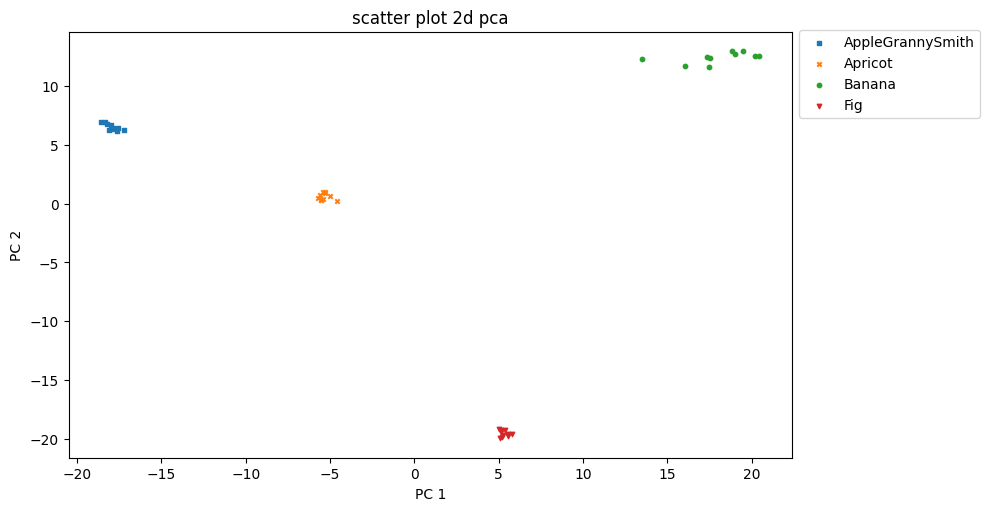

# CloudFruit360

## Description
This project demonstrates the development of an image processing pipeline designed for companies aiming to implement automated fruit recognition at scale. It leverages Big Data technologies to handle massive datasets, providing a scalable and efficient solution suitable for real-world applications such as intelligent agricultural systems or consumer-facing mobile apps. The pipeline integrates feature extraction, dimensionality reduction, and optimized data storage within a cloud-based infrastructure.

## Objectives
- Build a Big Data infrastructure to process large-scale image datasets.
- Extract image features using deep learning models.
- Reduce data dimensions while preserving variance with PCA.
- Deliver a scalable and production-ready solution.

## Dataset
- **Source**: [Kaggle - Fruits 360](https://www.kaggle.com/moltean/fruits)
- **Details**:
  - 131 varieties of fruits and vegetables.
  - Over 90,000 images (100x100, JPEG, RGB).
  - White backgrounds, centered fruits, various angles.

## Project Architecture
### Processing Pipeline
1. **Data Loading**:
   - Store images in AWS S3.
   - Partition data for distributed processing.
2. **Feature Extraction**:
   - Use VGG16 (pre-trained on ImageNet).
3. **Dimensionality Reduction**:
   - Apply Principal Component Analysis (PCA) to reduce data size while retaining key information.
4. **Result Storage**:
   - Save processed data in Parquet format (optimized for Big Data).

### Infrastructure
- **Cloud**: AWS (S3 for storage, EC2 for computation).
- **Big Data Framework**: PySpark (Python interface for Apache Spark).
- **Additional Tools**:
  - Jupyter Notebook for development and visualization.
  - AWS CLI for managing cloud resources.

## Results
- Efficient feature extraction using VGG16.
- 2D visualization of PCA-reduced data, showing clear distinctions between fruit classes.
  
- Optimized storage of reduced data for further analysis.

## Installation and Execution
### Prerequisites
- AWS account set up.
- Python 3.10+ installed.
- SSH key for EC2 instance access.

### Steps
1. **Configure AWS CLI**:
   ```bash
   aws configure

